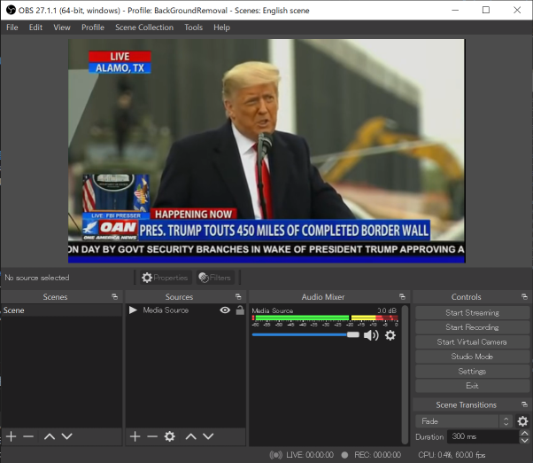
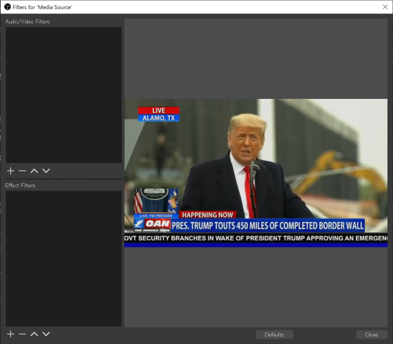
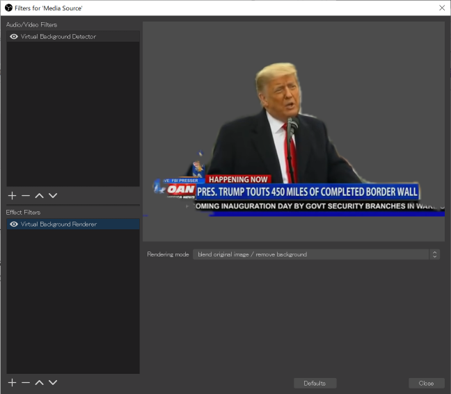
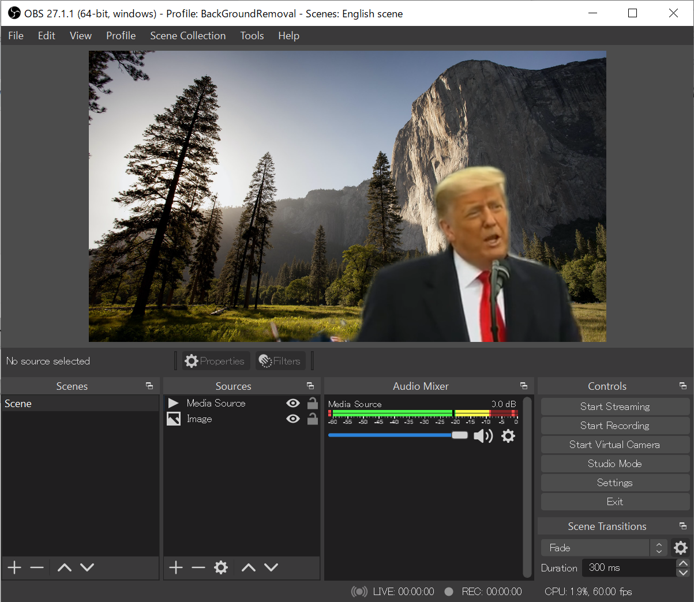

# OBS Virtual background plugin

English / [Japanese](./README_ja.md)

**OBS Virtual background plugin** is a plugin for OBS. This plugin allows you to crop the background area without a green screen like Zoom and Meet virtual backgrounds.
## Supported Operating System

Currently, this plugin supports only Windows 64bit environment.

## Install

Download the latest version of obs-virtualbg-vX.X.X-win64.zip from Releases on the right side of the [GitHub Page](https://github.com/kounoike/obs-virtualbg).

Extract the zip and copy the `data` and `obs-plugins` folders to your OBS Studio Folder (`C:\Program Files\obs-studio` by default).

Note: If you have the **OBS Background removal plugin** installed, uninstall it first, because the ONNXRuntime DLL will conflict.

## Usage

### filter settings

Add **Media source** or **Video capture device** to scene, and open Filters.

Add **Virtual Background Detector** to Audio/Video Filters. and also add **Virtual Background Renderer** to Effect Filters. **Both** filters required.

### Background settings

Place a background image, window capture, or game capture source below the filtered source. Set the size, crop, etc. to complete the settings.

## Caution

Since the human region is detected by inference using a deep learning model, detection error inevitably occur. In some cases, the person's area is not detected and is transparent, and in other cases, the background area is mis-detected and some of the room is shown. In particular, it is not good at recognizing hands, so it may not be suitable for performance. This is a limitation of the detection model and is not something that can be adjusted by adjusting parameters. If you need accurate cropping, please use the green background and chroma key filters.

