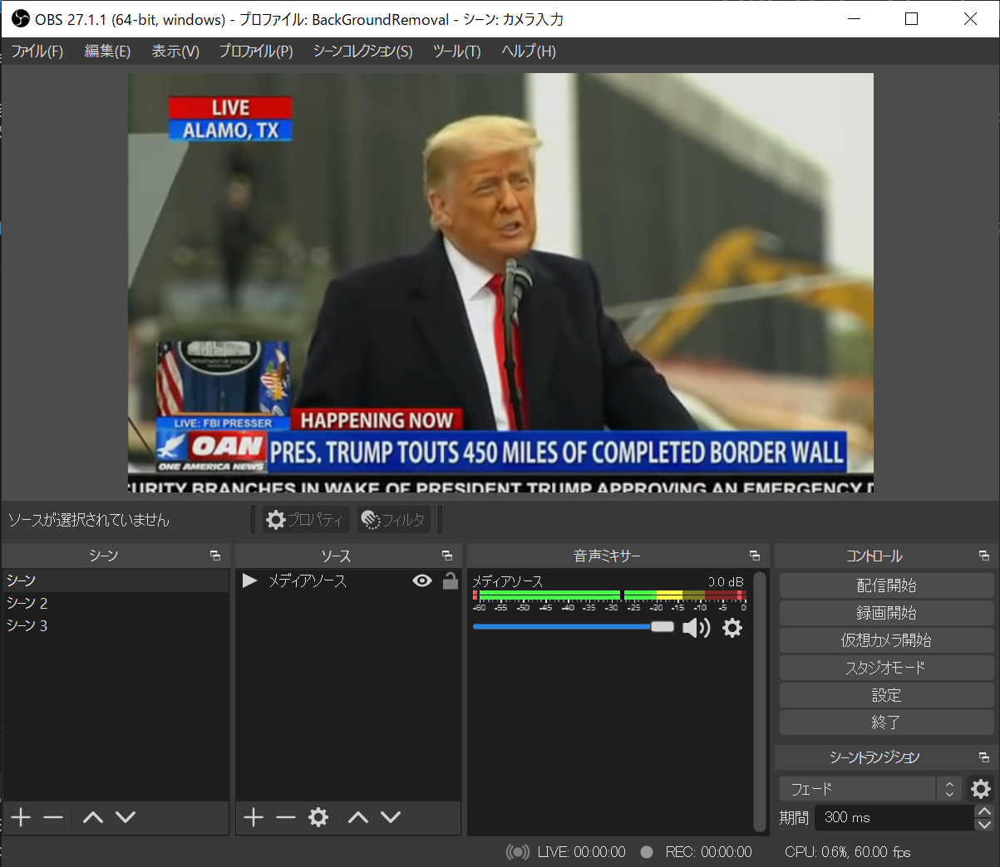
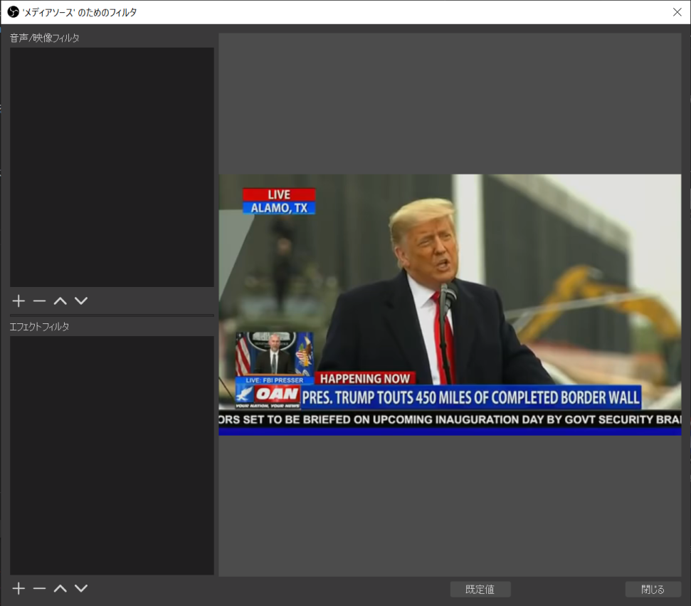
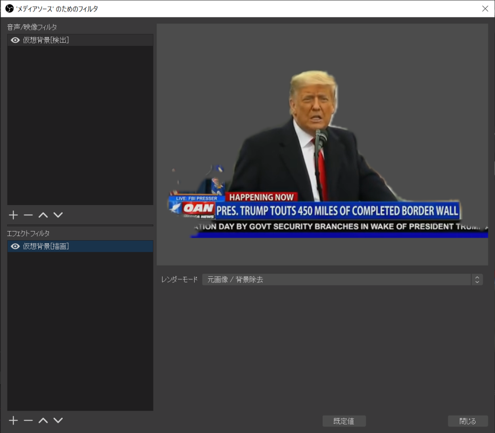
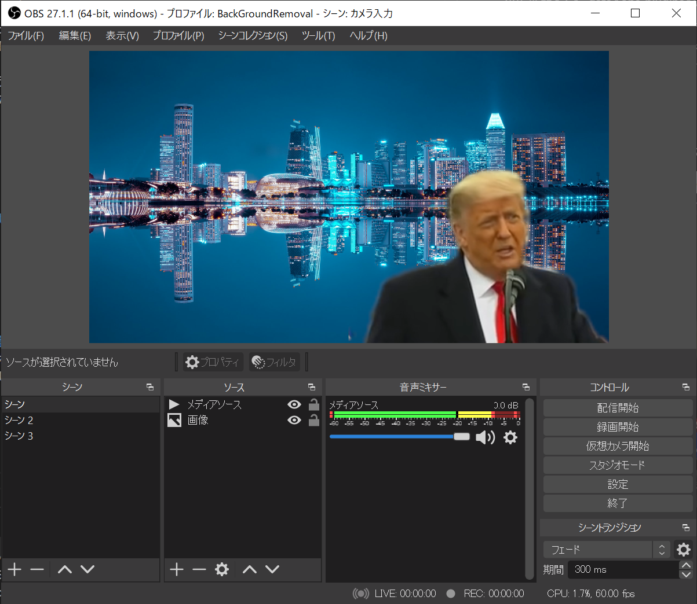

# OBS Virtual background plugin

[English](README.md) / Japanese

**OBS Virtual background plugin** は Zoom や Meet のバーチャル背景のようなグリーンバックなしでの背景領域の切り取り処理を OBS で行えるようにするプラグインです。

## 対応OS

現時点では Windows 64bit 環境のみに対応しています。

## インストール方法

[GitHubのページ](https://github.com/kounoike/obs-virtualbg)右側の**Releases**から最新版のobs-virtualbg-vX.X.X-win64.zipをダウンロードします。

ZIPを展開すると、dataとobs-pluginsというフォルダがあるので、そのままOBS Studioのフォルダにコピーします（デフォルトであれば `C:\Program Files\obs-studio`）。

※OBS Background removalプラグインをインストールしている場合は先にアンインストール（ZIPに入っていたファイルを削除）してください。ONNXRuntimeのDLLが衝突するためです。

## 使い方

### フィルタの設定

**メディアソース**または**映像キャプチャデバイス**をシーンに追加し、フィルタを開きます。

音声/映像フィルタに**仮想背景[検出]**を、エフェクトフィルタに**仮想背景[描画]**を設定します。必ず両方に設定することと、それぞれ1つずつになるようにしてください。パラメータもいくつかありますが、デフォルトで大体問題ないです。

### 背景の設定

フィルタを設定したソースより**下**に背景になる画像やウインドウキャプチャ・ゲームキャプチャなどのソースを配置してください。サイズやクロップなどを設定して設定完了です。

## 注意事項

ディープラーニングモデルでの推論により人物領域を検出しているため、どうしても誤検出が発生します。人物領域が検出されず透過されることもあれば、背景領域を誤検出して、部屋の様子が多少映ってしまう場合もあります。特に手の認識が苦手なため、パフォーマンスには向かないかもしれないです。これは検出モデルの限界であり、パラメータ調整で調整しきれるものではありません。正確な切り抜きを必要とする場合はグリーンバックとクロマキーフィルタをご利用ください。

